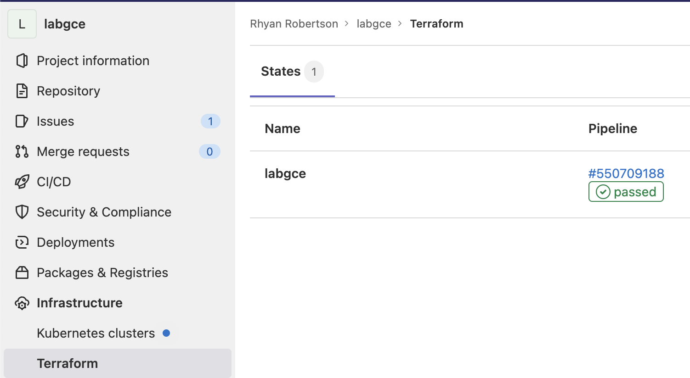

# Cloud Computing

## LAB07: Infrastructure-as-Code and Configuration Management - Terraform, Ansible and GitLab

De Bleser Dimitri, Peer Vincent, Robertson Rhyan

29.05.2022

https://github.com/RobertsonRhyan/CLD_LAB07

### TASK 2: CREATE A CLOUD INFRASTRUCTURE ON GOOGLE COMPUTE ENGINE WITH TERRAFORM

#### Deliverables Task 2

>Explain the usage of each provided file and its contents by directly adding comments in the file as needed (we must ensure that you understood what you have done). In the file variables.tf fill the missing documentation parts and link to the online documentation. Copy the modified files to the report.

main.tf

```terraform
/* Set a cloud provider, here it's google 
    - Set the project id (e.g. labce-350710)
    - Set the region (A region is a specific geographical location where you can run your resources)
    - Set the Service Account Key location
*/
provider "google" {
  project     = var.gcp_project_id
  region      = "europe-west6-a"
  credentials = file("${var.gcp_service_account_key_file_path}")
}

/* Set ressources for VM
  - Give the instance a name
  - Set type
  - Set zone of instance (A zone is an isolated location within a region. 
    The zone determines what computing resources are available and where your data is stored and used)
  - Setup SSH connection :
    - Get SSH user name from tf vars and set it
    - Get SSH public key location from tf vars and set it
  - Define what image to run on the instance
  - Setup network interface
*/
resource "google_compute_instance" "default" {
  name         = var.gce_instance_name
  machine_type = "f1-micro"
  zone         = "europe-west6-a"

  metadata = {
    ssh-keys = "${var.gce_instance_user}:${file("${var.gce_ssh_pub_key_file_path}")}"
  }

  boot_disk {
    initialize_params {
      image = "debian-cloud/debian-11"
    }
  }

  network_interface {
    network = "default"

    access_config {
      # Include this section to give the VM an external IP address
    }
  }
}

/* Add firewall rule
  - Set name of rule
  - Set on which network to add rule
  - Set allowed source (here any IP)
  - Set allowed PORT (here 22 for SSH)
*/
resource "google_compute_firewall" "ssh" {
  name          = "allow-ssh"
  network       = "default"
  source_ranges = ["0.0.0.0/0"]
  allow {
    ports    = ["22"]
    protocol = "tcp"
  }
}

// Same as for SSH but for HTTP
resource "google_compute_firewall" "http" {
  name          = "allow-http"
  network       = "default"
  source_ranges = ["0.0.0.0/0"]
  allow {
    ports    = ["80"]
    protocol = "tcp"
  }
}
```

outputs.tf

```terraform
/* Print values in the CLI output after running terraform apply
  Here the External IP of the instance will be displayed
*/

output "gce_instance_ip" {
  value = google_compute_instance.default.network_interface.0.access_config.0.nat_ip
}
```

variables.tf

```terraform
/* Print values in the CLI output after running terraform apply
  Here the External IP of the instance will be displayed
*/
output "gce_instance_ip" {
  value = google_compute_instance.default.network_interface.0.access_config.0.nat_ip
}
```

terraform.tfvars

```terraform
// Set env vars

gcp_project_id="labce-350710"
gcp_service_account_key_file_path="../credentials/labce-350710-17f927aba8a6.json"
gce_instance_name="l7grp"
gce_instance_user="rhyan"
gce_ssh_pub_key_file_path="../credentials/labgce-ssh-key.pub"
```

>Explain what the files created by Terraform are used for.

```bash
.
├── .terraform
│   ├── plan.cache
│   ├── providers
│   │   └── registry.terraform.io
│   │       └── hashicorp
│   │           └── google
│   │               └── 4.21.0
│   │                   └── darwin_arm64
│   │                       └── terraform-provider-google_v4.21.0_x5
│   └── terraform.tfstate
├── .terraform.lock.hcl
├── backend.tf
├── main.tf
├── outputs.tf
├── terraform.tfvars
└── variables.tf
````

"the module" = root module in this case

- main : Contains the main set of configuration for the module
- variables : Contains the variable definitions for the module
- outputs : Contains the output definitions for the module
- terraform.tfvars : Contains the arguments passed to the module
- backend : Primarily determine where Terraform stores its state.
- .terraform.lock.hcl : Version constraints within the configuration itself determine which versions of dependencies are potentially compatible, but after selecting a specific version of each dependency Terraform remembers the decisions it made in the dependency lock file so that it can (by default) make the same decisions again in future.
- terraform.tfstate : Used by Terraform to map real world resources to your configuration, keep track of metadata, and to improve performance for large infrastructures.
- plan.cache : Store the "plan" (the changes that will be made to your infrastructure).
- providers : Used to provision resources, which describe one or more infrastructure objects like virtual networks and compute instances.

>Where is the Terraform state saved? Imagine you are working in a team and the other team members want to use Terraform, too, to manage the cloud infrastructure. Do you see any problems with this? Explain.

The state is saved in the terraform.tfstate file on local machine by default.
If multiple people want to change the state, the best practise is to store terraform.tfstate in a Terraform backend. 

>What happens if you reapply the configuration (1) without changing main.tf (2) with a change in main.tf? Do you see any changes in Terraform\'s output? Why? Can you think of exemples where Terraform needs to delete parts of the infrastructure to be able to reconfigure it?

Yes there is a diffrence because if we run apply without changing the configuration, terraform compares the current state with the config file and doesn\'t notice any changes so does nothing. Whereas if we change the config, terraform will notice the differences between the state and the config and applies them.

1. Nothing should happen because the state is the same as in main.tf.

```bash
terraform apply -input=false .terraform/plan.cache


Apply complete! Resources: 0 added, 0 changed, 0 destroyed.

Outputs:

gce_instance_ip = "34.65.199.76"
```

2. The modification will be applied

```bash
terraform apply -input=false

google_compute_firewall.ssh: Refreshing state... [id=projects/labce-350710/global/firewalls/allow-ssh]
google_compute_firewall.http: Refreshing state... [id=projects/labce-350710/global/firewalls/allow-http]
google_compute_instance.default: Refreshing state... [id=projects/labce-350710/zones/europe-west6-a/instances/l7grp]

Terraform used the selected providers to generate the following execution plan. Resource actions are indicated with the following symbols:
  + create

Terraform will perform the following actions:

  # google_compute_firewall.https will be created
  + resource "google_compute_firewall" "https" {
      + creation_timestamp = (known after apply)
      + destination_ranges = (known after apply)
      + direction          = (known after apply)
      + enable_logging     = (known after apply)
      + id                 = (known after apply)
      + name               = "allow-https"
      + network            = "default"
      + priority           = 1000
      + project            = (known after apply)
      + self_link          = (known after apply)
      + source_ranges      = [
          + "0.0.0.0/0",
        ]

      + allow {
          + ports    = [
              + "443",
            ]
          + protocol = "tcp"
        }
    }

Plan: 1 to add, 0 to change, 0 to destroy.

Do you want to perform these actions?
  Terraform will perform the actions described above.
  Only 'yes' will be accepted to approve.

  Enter a value: yes

google_compute_firewall.https: Creating...
google_compute_firewall.https: Still creating... [10s elapsed]
google_compute_firewall.https: Creation complete after 20s [id=projects/labce-350710/global/firewalls/allow-https]

Apply complete! Resources: 1 added, 0 changed, 0 destroyed.

Outputs:

gce_instance_ip = "34.65.199.76"
```

>Explain what you would need to do to manage multiple instances.

Add another instance in main.tf

>Take a screenshot of the Google Cloud Console showing your Google Compute instance and put it in the report.


### TASK 4: CONFIGURE ANSIBLE TO CONNECT TO THE MANAGED VM

#### Deliverables Task 4

> What happens if the infrastructure is deleted and then recreated with Terraform? What needs to be updated to access the infrastructure again?

The IP of the instance might change.

### TASK 5: INSTALL A WEB SERVER AND CONFIGURE A WEB SITE

#### Deliverables Task 5

> Explain the usage of each file and its contents, add comments to the different blocks if needed (we must ensure that you understood what you have done). Link to the online documentation. Link to the online documentation.

```bash
.
├── ansible
│   ├── ansible.cfg
│   ├── hosts
│   └── playbooks
│       ├── files
│       │   └── nginx.conf
│       ├── templates
│       │   └── index.html.j2
│       └── web.yml
├── credentials
│   ├── labgce-service-account-key.json
│   ├── labgce-ssh-key
│   └── labgce-ssh-key.pub
└── terraform
    ├── backend.tf
    ├── main.tf
    ├── outputs.tf
    ├── terraform.tfstate
    ├── terraform.tfstate.backup
    ├── terraform.tfvars
    └── variables.tf
```

- ansible.cfg : The main config file for Ansible.

```bash
[defaults]
# Set inventory to the hosts file we created
inventory = hosts
# Set user name for the SSH connection
remote_user = rhyan
# Set path to SSH priv key
private_key_file = ~/Documents/GitHub/CLD/CLD_LAB07/credentials/labgce-ssh-key
# Disable for debuging (Every time we recreate an instance, the key while change)
host_key_checking = false
# Disable warnings
deprecation_warnings = false
````

- hosts : Contains inventory
- playbooks/web.yml : Is the playbook that we\'re using to setup the NGINX server.

```yml
- name: Configure webserver with nginx # Playbook Name 
  hosts: webservers # Set target hosts (here are only instance)
  become: True # Activate privilege escalation
  tasks:  # Tasks to run
    - name: install nginx
      apt: name=nginx update_cache=yes
    - name: copy nginx config file
      copy: src=files/nginx.conf dest=/etc/nginx/sites-available/default
    - name: enable configuration
      file: >
        dest=/etc/nginx/sites-enabled/default
        src=/etc/nginx/sites-available/default
        state=link
    - name: copy index.html
      template: src=templates/index.html.j2 dest=/usr/share/nginx/html/index.html mode=0644
    - name: restart nginx
      service: name=nginx state=restarted

```

- files/nginx.conf : NGINX config file, copy when the playbook is run
- templates/index.html.j2 : Our landing page, also copy via the playbook.

> Copy your hosts file into your report.

```bash
[webservers]
gce_instance ansible_ssh_host=34.65.199.76
```

### TASK 6: ADDING A HANDLER FOR NGINX RESTART

#### Deliverables Task 6

> Copy the modified playbook into your report.

```yaml
- name: Configure webserver with nginx # Playbook Name 
  hosts: webservers # Set target hosts (here are only instance)
  become: True # Activate privilege escalation
  tasks:  # Tasks to run
    - name: install nginx
      apt: name=nginx update_cache=yes
    - name: copy nginx config file
      copy: src=files/nginx.conf dest=/etc/nginx/sites-available/default
      notify: restart nginx
    - name: enable configuration
      file: >
        dest=/etc/nginx/sites-enabled/default
        src=/etc/nginx/sites-available/default
        state=link
      notify: restart nginx
    - name: copy index.html
      template: src=templates/index.html.j2 dest=/usr/share/nginx/html/index.html mode=0644
    - name: restart nginx
      service: 
        name=nginx 
        state=restarted
```

### TASK 7: TEST DESIRED STATE CONFIGURATION PRINCIPLES

#### Deliverables Task 7

> Return to the output of running the web.yml playbook the first time. There is one additional task that was not in the playbook. Which one? 

Gathering Facts

> Among the tasks that are in the playbook there is one task that Ansible marked as ok. Which one? Do you have a possible explanation?

TASK [Enable configuration], it's status is "ok" because it creates a symbolic and doesn\'t copy a file.

> What is the differences between Terraform and Ansible? Can they both achieve the same goal?

Terraform is more of an Orchestration tool whereas Ansible is more of a Configuration Management tool.
Terraform is Declarative and Ansible is Procedural.

They can both achieve the same goal, although in a limited way.

> List the advantages and disadvantages of managing your infrastructure with Terraform/Ansible vs. manually managing your infrastructure. In which cases is one or the other solution more suitable?

The main advantages of Terraform/Ansible for managing the infrastructure :

- Copy the exact same infrastructure (e.g. for Dev, Test and Prod)
- Avoid documentation drift (Difference between documentation and actual state of infrastructure). Any modification to the code reprensents the actual state. No more forgetting to update the documentation.
- Backup. If a disater occurs and the infrastructre is lost, we can just rerun the code to have the same setup.

The main advantages of manualy managing the infrastructure :

- Easier for debuging and testing
- Good for learing the intricacies of infrastructre

> Suppose you now have a web server in production that you have configured using Ansible. You are working in the IT department of a company and some of your system administrator colleagues who don't use Ansible have logged manually into some of the servers to fix certain things. You don't know what they did exactly. What do you need to do to bring all the server again to the initial state? We'll exclude drastic changes by your colleagues for this question.

Destroy and rerun terraform

### TASK 8 (OPTIONAL): CONFIGURE YOUR INFRASTRUCTURE USING A CI/CD PIPELINE

#### Deliverables Task 8

> Explain the usage of each file and its contents, add comments to the different blocks if needed (we must ensure that you understood what you have done). Link to the online documentation.

> Explain what CI/CD stands for.

Continuous integration and continuous delivery

> Where is the Terraform state saved? Paste a screenshot where you can see the state with its details in GitLab.



> Paste a link to your GitLab repository as well as a link to a successful end-to-end pipeline (creation, configuration and destruction of your infrastructure).

https://gitlab.com/RobertsonRhyan/labgce

Can't get the ansible playbook to work (SSH issue)
https://gitlab.com/RobertsonRhyan/labgce/-/pipelines/550715482

> Why are some steps manual? What do we try to prevent here?

Maybe to make sure that the instance is up and running

> List the advantages and disadvantages of managing your infrastructure locally or on a platform such as GitLab. In which cases is one or the other solution more suitable?

Working in a team is easier with GitLab but can be a lot of overhead for 1 person
